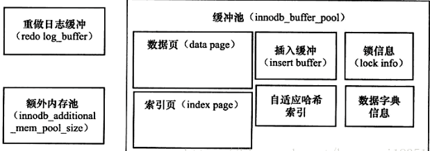
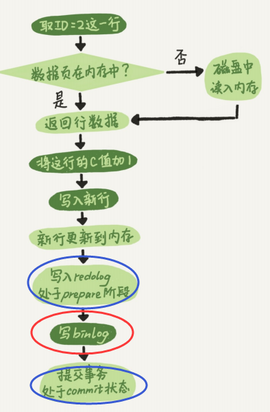

# 《Mysql技术内幕：Innodb存储引擎》读书笔记

1. 存储引擎基于表而不是数据库。

# InnoDB概述

1. 将数据放在一个逻辑的表空间
2. 4.1之后将表单独存放在一个独立的idb文件中
3. 支持裸设备建立表空间
4. 通过多版本并发控制（MVCC）提高并发性，实现了四种隔离级别，默认为repeatable
5. 使用next-key locking的策略避免幻读
6. 提高插入缓存，二次写，自适应哈希索引，预读
7. 支持全文索引（1.2版本以后）

InnoDB采用聚集方式，表的存储都是按照主键的顺序进行存放。没有主键InnoDB会给每一行的记录生成一个6字节的ROWID，作为主键。

# MyISAM概述

1. 不支持事务，表锁，
2. 支持全文索引
3. 只缓存索引文件，不缓存数据文件
4. 表由MYD和MYI组成，MYD存储数据，MYI存储索引
5. 5.0之前4GB，之后256TN单表数据
6. 64位系统支持4GB以上的索引缓存区

# InnoDB内存



### WHL技术：redo log & binlong

write ahead logging：先写日志，在写入磁盘

InnoDB会先将记录写入到redo log，并更新内存，会在系统空闲时将redo log写入磁盘，redo log固定大小（可以配置一组，每组4个，可以循环写入），redo log可以确保当数据库异常重启后，之前的记录不会丢失

|             redo log             |                  binlog                   |
| :------------------------------: | :---------------------------------------: |
|            InnoDB特有            | mysql的server层实现，所有的存储引擎都可用 |
| 物理日志，某个数据页做了什么修改 |         逻辑日志，语句的原始逻辑          |
|        循环写入，空间固定        |            追加写入，不会覆盖             |
|                                  |                                           |
|                                  |                                           |
|                                  |                                           |

比如有sql：

```sql
update user set name = 'kkk' where id = 2; 
```




# 事务

#### 事务的隔离级别

##### Read uncommitted（读未提交）

顾名思义，就是一个事务可以读取另一个未提交事务的数据。

**事例：**老板要给程序员发工资，程序员的工资是3.6万/月。但是发工资时老板不小心按错了数字，按成3.9万/月，该钱已经打到程序员的户口，但是事务还没有提交，就在这时，程序员去查看自己这个月的工资，发现比往常多了3千元，以为涨工资了非常高兴。但是老板及时发现了不对，马上回滚差点就提交了的事务，将数字改成3.6万再提交。

**分析：**实际程序员这个月的工资还是3.6万，但是程序员看到的是3.9万。他看到的是老板还没提交事务时的数据。这就是<font color = #FF0000 >脏读</font>。

---

##### Read committed（读提交）

读提交，顾名思义，就是一个事务要等另一个事务提交后才能读取数据。

**事例：**程序员拿着信用卡去享受生活（卡里当然是只有3.6万），当他埋单时（程序员事务开启），收费系统事先检测到他的卡里有3.6万，就在这个时候！！程序员的妻子要把钱全部转出充当家用，并提交。当收费系统准备扣款时，再检测卡里的金额，发现已经没钱了（<font color = #ff0000>第二次检测金额当然要等待妻子转出金额事务提交完</font>>）。程序员就会很郁闷，明明卡里是有钱的…

**分析：**这就是读提交，若有事务对数据进行**更新（UPDATE）**操作时，读操作事务要等待这个更新操作事务提交后才能读取数据，可以解决脏读问题。但在这个事例中，出现了<font color=#FF0000>一个事务范围内两个相同的查询却返回了不同数据</font>>，这就是<font color = #ff0000>不可重复读</font>>。

---

##### Repeatable read（可重复读）

重复读，就是在开始读取数据（事务开启）时，不再允许修改操作

**事例：**程序员拿着信用卡去享受生活（卡里当然是只有3.6万），当他埋单时（事务开启，不允许其他事务的UPDATE修改操作），收费系统事先检测到他的卡里有3.6万。这个时候他的妻子不能转出金额了。接下来收费系统就可以扣款了。

**分析：**重复读可以解决不可重复读问题。写到这里，应该明白的一点就是，<font color=#ff0000>不可重复读对应的是修改，即UPDATE操作</font>。但是可能还会有<font color=#ff0000>幻读</font>问题。因为<font color=#ff0000>幻读问题对应的是插入INSERT操作，而不是UPDATE操作</font>。

***什么时候会出现幻读？***

**事例：**程序员某一天去消费，花了2千元，然后他的妻子去查看他今天的消费记录（全表扫描FTS，妻子事务开启），看到确实是花了2千元，就在这个时候，程序员花了1万买了一部电脑，即<font color=#ff0000>新增INSERT</font>了一条消费记录，并提交。当妻子打印程序员的消费记录清单时（妻子事务提交），发现花了1.2万元，似乎出现了幻觉，这就是幻读。

那怎么解决幻读问题？Serializable！

---

##### Serializable 序列化

Serializable 是最高的事务隔离级别，在该级别下，事务串行化顺序执行，可以避免脏读、不可重复读与幻读。但是这种事务隔离级别效率低下，比较耗数据库性能，一般不使用。


1. 数据完整性

   1. 实例完整性
      1. 保证一张表的有一个主键，用户可定义Primary Key或者Unique Key保证实例完整性
   2. 域完整性
      1. 选择合适的数据类型去报一个数据值满足特定条件
      2. 外键约束
      3. 触发器
      4. default约束强制完整性

2. InnoDB存储引擎提供的约束

   1. primary key
   2. unique key
   3. foreign key
   4. default
   5. not null

3. 索引与算法

   InnoDB支持B+树索引，全文索引，哈希索引

   1. InnoDB自动为表生成哈希索引，不可人为干预

4. B+树，平衡查找树

   1. 只找到被查找的数据所在的页，然后把页读入到内存，然后在内存中查找，得到查找的数据

   2. [InnoDB一棵B+树可以存放多少行数据？](https://www.cnblogs.com/leefreeman/p/8315844.html)

5. InnoDB的hash算法

   1. 采用连地址法
   2. h(k) = k mod m
   3. m取值为缓冲池（innodb_buffer_pool_size）的2倍数量的质数

# 锁

## 概念

解决数据库中共享数据的并发访问。InnoDB对行级别上对表上锁，提供一致性的非锁定读，行级锁支持，行级锁没有额外的开销，同时保证了并发性和一致性。

## 锁的类型

### 共享锁（行锁，X锁）

允许事务读一行数据。

事务A获取了行r的共享锁，事务B也可以获取行r的共享锁。这是**锁兼容**，如果事务C想要获取行r的排他锁，必须等事务A、B释放行r的共享锁，这是**锁不兼容**。

### 排他锁（行锁，S锁）

允许事务删除或更新一行数据

### 意向锁

### 一致性非锁定读

如果读取的数据正在被某个事务执行update或者delete操作，读取操作不会等到行上锁的释放，**相反地**，InnoDB会读取行的快照数据。快照数据为之前版本的数据。**提高了并发性**。

不同的事务隔离方式，读取的方式不同。
|        事务的隔离级别        | 脏读 | 不可重复读 | 幻读 |
| :--------------------------: | :--: | :--------: | :--: |
| 读未提交（read-uncommitted） |  是  |     是     |  是  |
|  读已提交（read-committed）  |  否  |     是     |  是  |
| 可重复读（repeatable-read）  |  否  |     否     |  是  |
|    串行化（serializable）    |  否  |     否     |  否  |

**可重复读（repeatable-read）**：，同一个事务，连续两次执行相同的sql，返回的结果可能不同。innoDB采用的是Next-key locking机制即刻避免**幻读**。

 不可重复读的和幻读很容易混淆，不可重复读侧重于**修改（update）**，幻读侧重于**新增或删除**。

### InnoDB提供了三种锁的算法

行锁(record-lock)、间隙锁(gap-lock)、行锁+间隙锁(Next-key locking)（锁定记录本身，锁定一个范围）

当查询的索引有唯一属性（例如**唯一主键**）时，Next-key locking会退化为record-lock，从而提高系统的并发性。
