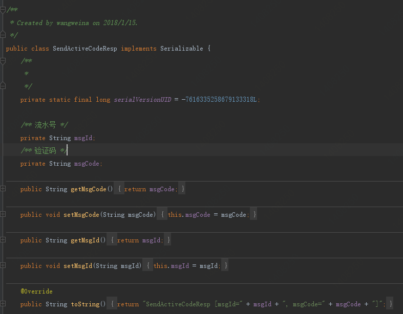
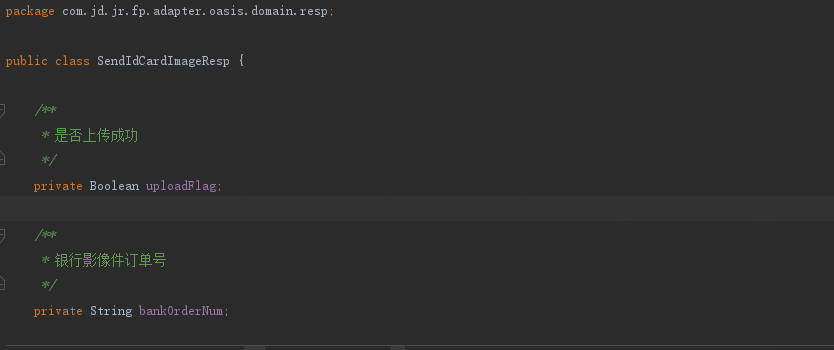
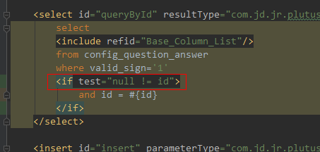

<!-- @import "[TOC]" {cmd="toc" depthFrom=1 depthTo=6 orderedList=false} -->
<!-- code_chunk_output -->

* [1、发送短信验证码resp为什么需要实现序列化接口](#1-发送短信验证码resp为什么需要实现序列化接口)
* [2、Boolean和boolean区别？包装类与基本数据类型区别？](#2-boolean和boolean区别包装类与基本数据类型区别)
* [3、mybatis传入单个参数值，if判断报错](#3-mybatis传入单个参数值if判断报错)

<!-- /code_chunk_output -->

# 1、发送短信验证码resp为什么需要实现序列化接口

# 2、Boolean和boolean区别？包装类与基本数据类型区别？

请求参数使用包装类，因为请求参数可能为null，

返回参数无所谓，因为返回参数一般数据结构定义好之后，一般布尔变量要么是true要么false。

# 3、mybatis传入单个参数值，if判断报错

错误分析：
