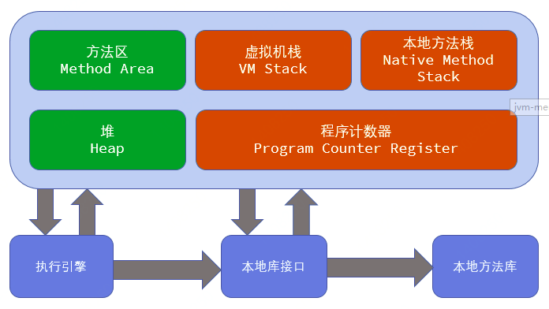
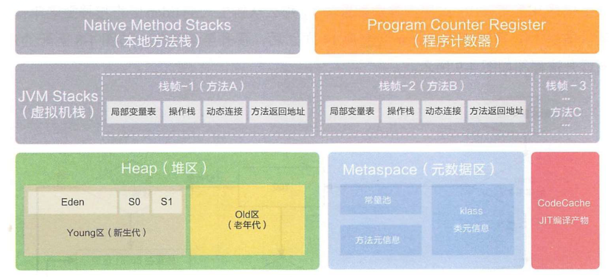

<!-- TOC depthFrom:1 depthTo:6 withLinks:1 updateOnSave:1 orderedList:0 -->

- [1. jvm运行时数据区](#1-jvm运行时数据区)
	- [1.1 jdk 1.7](#11-jdk-17)
		- [1.1.1 程序计数器](#111-程序计数器)
		- [1.1.2 虚拟机栈](#112-虚拟机栈)
			- [局部变量表](#局部变量表)
		- [1.1.3 本地方法栈](#113-本地方法栈)
		- [1.1.4 堆](#114-堆)
		- [1.1.5 方法区(与堆很像)](#115-方法区与堆很像)
	- [1.2 jdk 1.8](#12-jdk-18)

<!-- /TOC -->
# 1. jvm运行时数据区

## 1.1 jdk 1.7



### 1.1.1 程序计数器

标识了当前线程所执行的字节码的行号指示器，正常程序的分支，循环，跳转，异常等都是通过程序计数器完成。

<font color=#FF0000>线程私有</font>：每个线程独立拥有一个程序计数器。<font color=#FF0000>没有OutOfMemoryError</font>。

java方法记录字节码指令的地址，native方法则是Undefined。


### 1.1.2 虚拟机栈

描述的是java方法执行的线程内存模型。每个方法执行的时候jvm会同步创建一个栈帧，存放<font color=#FF0000>局部变量，方法出口</font>等信息

<font color=#FF0000>线程私有</font>：每个线程独立拥有自己的栈。

当栈的深度大于jvm允许的深度：<font color=#FF0000>StackOverflowError</font>

当栈动态扩展时，无法申请到足够的内存：<font color=#FF0000>OutOfMemoryError</font>

> **【面试题】写一个StackOverflowError的异常出来**
>
> ```java
> public class StackOverflowError{
>     public static void main(String[] args) {
>         fun();
>     }
>     public static void fun(){
>         fun();
>     }
> }
>
> ```
>
> **【面试题】写一个OutOfMemoryError的异常出来**
>
> ```java
> public class OutOfMemoryError{
> 	public static void main(String[] args) {
>         List<Object> list = new ArrayList<Object>();
>         while (true){
>             list.add(new Object());
>        }
>     }
> }
> ```
>
>


#### 局部变量表

- 保存了编译期间产生的基本数据类型（boolean,byte,char,short,int,float,long,double），对象引用，returnAddress类型（字节码指令的地址）。

- long，double类型（64位）占用两个变量槽
- 编译期间完成
- 方法运行期间不会改变大小

### 1.1.3 本地方法栈

与虚拟机栈功能类似，为native方法提供服务，

当栈的深度大于jvm允许的深度：<font color=#FF0000>StackOverflowError</font>

当栈动态扩展时，无法申请到足够的内存：<font color=#FF0000>OutOfMemoryError</font>

***【备注】在HotSpot虚拟机中，本地方法栈与虚拟机栈合二为一***

### 1.1.4 堆

- 内存空间最大的一块
- 对象实例的创建，数组均在堆上创建
- GC的主要区域

### 1.1.5 方法区(与堆很像)

- 被虚拟机加载的类信息
- 常量
- 静态变量
- 编译器编译的类信息


## 1.2 jdk 1.8




**JDK8 之前，Hotspot 中方法区的实现是永久代（Perm），JDK8 开始使用元空间（Metaspace），以前永久代所有内容的字符串常量移至堆内存，其他内容移至元空间，元空间直接在本地内存分配。**

**为什么要使用元空间取代永久代的实现？**

1. 字符串存在永久代中，容易出现性能问题和内存溢出。

2. 类及方法的信息等比较难确定其大小，因此对于永久代的大小指定比较困难，太小容易出现永久代溢出，太大则容易导致老年代溢出。
3. 永久代会为 GC 带来不必要的复杂度，并且回收效率偏低。
4. 将 HotSpot 与 JRockit 合二为一。
