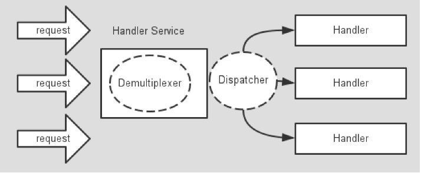
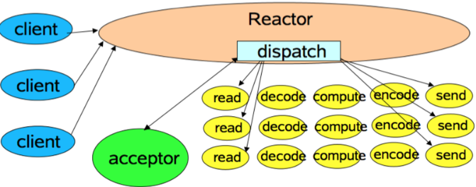
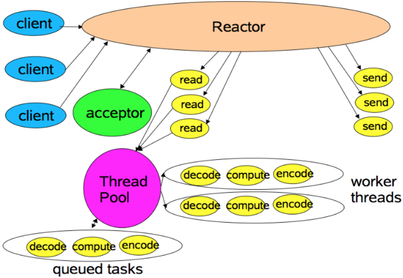
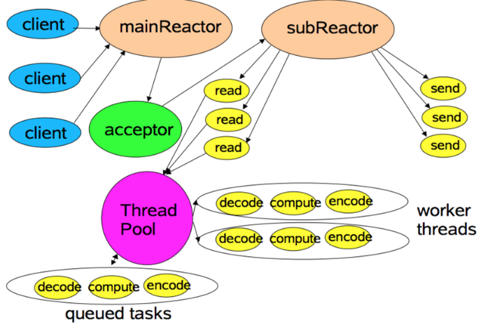

[TOC]

# 1.概念

**异步非阻塞**，基于java nio实现，支持tcp，udp，文件的传输

#  2.线程模型

##  2.1 Reactor模型

有一个或者多个并发输入源，有一个Server Handler和多个Request Handlers，这个Service Handler会同步的将输入的请求多路复用的分发给相应的Request Handler。

Reactor模式没有Queue来做缓冲，每当一个事件输入到Service Handler之后，该Service Handler会主动根据不同的Event类型将其分发给对应的Request Handler来处理。

1. 单线程模型

   

2. 多线程模

   

3. 主从模型

mainReactor负责监听server socket，accept新连接；并将建立的socket分派给subReactor。subReactor负责多路分离已连接的socket，读写网络数据，对业务处理功能，其扔给worker线程池完成。通常，subReactor个数上可与CPU个数等同。

## 2.2 EventLoopGroup/EventLoop

netty采用串行化设计，抛弃了主从模型中的线程池，避免了线程上下文的切换，数据也不会面临被并发修改

