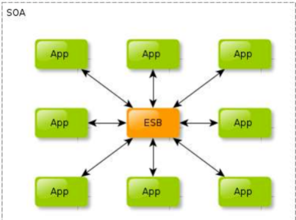

<!-- @import "[TOC]" {cmd="toc" depthFrom=1 depthTo=6 orderedList=false} -->
<!-- code_chunk_output -->

- [分布式系统](#分布式系统)
  - [1.集中式](#1集中式)
  - [2.分布式](#2分布式)
    - [挑战](#挑战)
  - [3.CAP理论与BASE理论](#3cap理论与base理论)
  - [4.分布式架构](#4分布式架构)
    - [4.1 SOA架构](#41-soa架构)
    - [4.2 微服务架构](#42-微服务架构)
- [参考](#参考)

<!-- /code_chunk_output -->

# 分布式系统

## 1.集中式

单个和多个节点提供单一的功能，

> 系统大，复杂，
>
> 难以维护
>
> 单点故障

## 2.分布式

一个功能有多个节点相互协调完成，

> 不受空间的限制，多个节点相互通信完成信息交流
>
> 引入协议，通信方式等问题

### 挑战

1. 异构的机器与网络
   1. 服务器的性能不同，程序的代码不同
   2. 节点的网络通信，不同的带宽，延时等
2. 节点故障
   1. 避免了单点故障，但是节点过多，故障概率增大
   2. 需要监控节点状态，需要协调服务，转移节点计算，存储任务等
3. 通信的异常
   1. 节点之间通过网络通信，存在不确定性，丢包，延时，
   2. 延时的不断产生，出现“脑裂”现象

## 3.CAP理论与BASE理论

CAP：一个分布式系统不可能同时满足一致性（C：Consistency）、可用性（A：Availability）和分区容错性（P：Partition tolerance）这三个基本需求，最多只能同时满足其中的两项。**zookeeper**在一定意义上牺牲了可用性，保证了分区容错性和一致性，zookeeper是强一致性（CP系统）。

BASE：是Basically Available（基本可用）、Soft state（软状态）和Eventually consistent（最终一致性）三个短语的简写。**淘宝的configserver**为了满足淘宝的高可用性的业务性能，实际上牺牲了一致性，属于AP系统[1]。

## 4.分布式架构

### 4.1 SOA架构

SOA 全称是: Service Oriented Architecture，中文释义为 “面向服务的架构”，它是一种设计理念，其中包含多个服务， 服务之间通过相互依赖最终提供一系列完整的功能。各个服务通常以独立的形式部署运行，服务之间 通过网络进行调用。

- ESB：企业级服务总线
- app：各个系统提供的服务

### 4.2 微服务架构

对于SOA的一种升级，强调去中心化，业务系统组件化，各个服务之间通过API网关负责通信，通常使rest访问api

# 参考

[1] https://blog.csdn.net/fly910905/article/details/85317975
